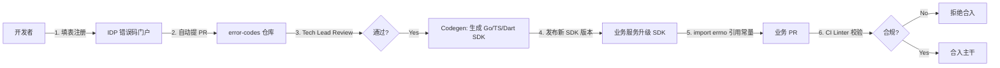

# 错误码系统规范

> 版本：V2.1.0 | 状态：生效 | 适用：Go / TS / Dart 全端
>
> **v2.1.0 变更**：错误码 SEMANTIC 段由自然语言改为定长 3 位数字 `001-999`，并按区间划分错误类别；目的是当 message 未正确返回时，仅凭错误码即可定位服务 / 模块 / 错误类型，再反查 IDP 门户即可拿到详细说明。
>
> **v2.0.0 变更**：错误码格式由纯数字改为 `{服务}_{模块}_{语义}`；强化"先注册后使用"闭环。


---

## 1. 核心原则

* **先注册后使用**：错误码必须先在 IDP 错误码门户注册通过、进入 SDK 后才能在代码中引用
* **单一事实源**：`error-codes` Git 仓库是唯一权威源，业务代码禁止硬编码任何数字 / 字符串作为错误码
* **可定位优先**：仅凭错误码（如 `TRADE_ORDER_201`）即可定位到服务 `trade` / 模块 `order` / 类型 `资源不存在`，再通过 IDP 或搜索拿到 message 详情
* **强契约**：自定义 CI Linter 拦截硬编码、未注册、跨服务借用的错误码，不通过禁止合入


---

## 2. 错误码格式

### 2.1 标准格式

```
{SERVICE}_{MODULE}_{NNN}
```

| 段   | 定长  | 说明  | 取值示例 |
|-----|-----|-----|------|
| SERVICE | 3\~10 字符 | 服务名，与数据库规范 §3.3 Schema 短名对齐，全大写 | `TRADE` / `WALLET` / `AUTH` / `RISK` / `MARKET` / `COMMON` |
| MODULE | 3\~10 字符 | 领域模块，全大写 | `ORDER` / `BALANCE` / `KYC` / `WITHDRAWAL` |
| NNN | **固定 3 位** | 数字序号，范围 `001-999`，不足前导补零 | `001` / `042` / `201` |

### 2.2 NNN 区间规则

每个 `{SERVICE}_{MODULE}` 组合下，NNN 按错误类别划分区间，便于一眼识别错误语义：

| 区间  | 类别  | 建议 HTTP | 典型场景 |
|-----|-----|---------|------|
| `001-099` | 业务参数 / 校验失败 | 400     | 价格超限、参数缺失 |
| `100-199` | 认证 / 授权 / 权限 | 401 / 403 | Token 过期、权限不足 |
| `200-299` | 资源不存在 | 404     | 订单 / 用户 / 交易对不存在 |
| `300-399` | 状态冲突 / 并发 | 409     | 乐观锁冲突、状态机非法流转 |
| `400-499` | 频率 / 配额 / 限流 | 429     | 请求频率超限、提现超日限额 |
| `500-599` | 内部异常 / 外部依赖 | 500 / 502 / 503 | DB 异常、下游服务不可用 |
| `900-999` | 预留 / 自定义 | —       | 紧急通道、实验性 |

### 2.3 示例

| 错误码 | 类别  | HTTP | 含义  |
|-----|-----|------|-----|
| `TRADE_ORDER_001` | 业务校验 | 400  | 订单价格超出允许区间 |
| `TRADE_ORDER_002` | 业务校验 | 400  | 订单数量低于最小下单量 |
| `TRADE_ORDER_201` | 资源不存在 | 404  | 订单未找到 |
| `TRADE_ORDER_301` | 状态冲突 | 409  | 订单状态流转冲突（乐观锁） |
| `WALLET_BALANCE_001` | 业务校验 | 400  | 余额不足 |
| `WALLET_WITHDRAWAL_401` | 限流 / 配额 | 429  | 提现超过日限额 |
| `WALLET_ADDRESS_001` | 业务校验 | 400  | 链上地址无效 |
| `AUTH_TOKEN_101` | 认证  | 401  | Token 过期 |
| `AUTH_KYC_102` | 授权  | 403  | 未完成 KYC |
| `RISK_IP_101` | 授权  | 403  | IP 被风控拦截 |
| `MARKET_SYMBOL_001` | 业务校验 | 400  | 交易对已下架 |
| `COMMON_COMMON_401` | 限流  | 429  | 请求频率超限 |
| `COMMON_COMMON_501` | 内部异常 | 500  | 内部服务异常 |

### 2.4 反模式（禁用）

```
❌ 100404               // 纯数字，看不出业务
❌ ERR_001              // 无服务 / 无模块
❌ orderNotFound        // 大小写混用 / 无结构
❌ TRADE.ORDER.404      // 分隔符错误 / 混入 HTTP
❌ TRADE_ORDER_1        // NNN 未补零（应为 001）
❌ TRADE_ORDER_1001     // NNN 超过 3 位
❌ TRADE_ORDER_NOT_FOUND // 语义段应为数字
```


---

## 3. 先注册后使用 · 强制流程



### 3.1 步骤说明


1. **注册**：开发者在 IDP 门户填写表单，门户自动分配 NNN（按所选区间从最小可用值递增）
2. **Review**：平台自动提交 PR 到 `error-codes` 仓，由所属服务 Tech Lead 审批；门户自动校验命名、区间与重复
3. **Codegen**：PR 合入 main 后流水线自动生成三端 SDK 并发版（语义化版本号）
4. **引用**：业务服务升级 SDK 版本后，`import "github.com/company/errno"`，直接引用常量
5. **CI Linter 校验**：业务 PR 合入前扫描代码，未注册 / 硬编码 / 跨服务借用一律拒绝

### 3.2 禁止绕过的操作

* 边写代码边"自创"错误码，等合入后再补注册
* 直接 `errors.New("some message")` 作为错误码
* 跨服务借用（trade 代码中返回 `WALLET_*`，应定义 `TRADE_UPSTREAM_xxx`）
* 手动改 `error-codes` 仓库 YAML 不走 IDP
* 自选 NNN 跳过区间规则（由门户强制分配）


---

## 4. 注册元数据

IDP 注册时必填字段：

| 字段  | 必填  | 示例  |
|-----|-----|-----|
| code | ✓（门户自动拼接） | `TRADE_ORDER_201` |
| service | ✓   | `trade` |
| module | ✓   | `order` |
| category | ✓   | `NOT_FOUND`（对应 200-299 区间） |
| message_zh | ✓   | `订单未找到，请检查单号` |
| message_en | ✓   | `Order not found` |
| http_status | ✓   | `404` |
| level | ✓   | `WARN` / `ERROR` / `FATAL` |
| owner | ✓   | `trade-team` |
| deprecated | ✗   | 默认 `false` |

### 4.1 YAML 存储示例

```yaml
# error-codes/trade.yaml
service: trade
codes:
  - code: TRADE_ORDER_001
    module: order
    category: VALIDATION
    message_zh: 订单价格超出允许区间
    message_en: Order price is out of the allowed range
    http_status: 400
    level: WARN
    owner: trade-team

  - code: TRADE_ORDER_201
    module: order
    category: NOT_FOUND
    message_zh: 订单未找到，请检查单号
    message_en: Order not found
    http_status: 404
    level: WARN
    owner: trade-team

  - code: TRADE_ORDER_301
    module: order
    category: CONFLICT
    message_zh: 订单状态流转冲突
    message_en: Order status transition conflict
    http_status: 409
    level: WARN
    owner: trade-team
```


---

## 5. 开发者使用规范（Go）

### 5.1 正确写法

```go
import (
    "github.com/company/pkg/errno"
    "github.com/company/pkg/xerror"
)

// ✅ 引用 SDK 常量（常量名由 Codegen 生成：SVC_MOD_NNN）
return xerror.New(errno.TRADE_ORDER_201).
    WithDetail("order_id", orderID).
    WithTrace(ctx)
```

### 5.2 错误写法

```go
// ❌ 硬编码字符串
return errors.New("order not found")

// ❌ 硬编码数字
return xerror.New(100404, "order not found")

// ❌ 字符串拼接错误码
code := "TRADE_ORDER_" + seq
return xerror.New(code)

// ❌ 跨服务借用（在 trade 服务中返回 wallet 的错误码）
return xerror.New(errno.WALLET_BALANCE_001)
```


---

## 6. CI Linter 校验

落地于 GitLab CI `lint` stage，基于 `go/ast` 扫描全部 `.go` 文件：

* 扫描 `xerror.New` / `xerror.Wrap` 等调用的第一参数
* 必须是 `errno.` 包导出常量
* 常量必须存在于当前 SDK 版本中
* 常量的 `SERVICE` 前缀必须等于当前服务名（防跨服务借用）
* 常量格式必须匹配正则：`^[A-Z]{3,10}_[A-Z]{3,10}_[0-9]{3}$`
* 报错格式示例：

```
[errno-lint] internal/order/service.go:42:
  hardcoded error code "order not found" detected.
  please register via IDP first: https://idp.internal/errno/new
```


---

## 7. 可观测性联动

错误码结构化后，可以在日志 / Trace / Metrics 里直接按 `SERVICE` / `MODULE` / 区间过滤：

* **日志（Loki）**：错误日志自动携带 `error_code` 标签，例：

  ```
  {error_code=~"TRADE_ORDER_.*"}        # 订单模块全部错误
  {error_code=~".*_.*_[23][0-9]{2}"}     # 所有"不存在 / 冲突"类错误
  ```
* **Trace（Tempo）**：Span Attribute 注入 `error.code`，错误码直接下钻到染色链路
* **Metrics（VictoriaMetrics）**：按 `error_code` 聚合 counter；Grafana 额外配"错误类别分布"面板（按 NNN 区间分组）
* **告警**：`level=FATAL` 自动触发 PagerDuty；`5xx` 区间错误码按阈值聚合告警


---

## 8. HTTP 状态码映射建议

| HTTP | NNN 区间 | 示例  |
|------|--------|-----|
| 400  | 001-099 | `TRADE_ORDER_001` |
| 401  | 100-199 | `AUTH_TOKEN_101` |
| 403  | 100-199 | `AUTH_KYC_102` / `RISK_IP_101` |
| 404  | 200-299 | `TRADE_ORDER_201` |
| 409  | 300-399 | `TRADE_ORDER_301` |
| 429  | 400-499 | `WALLET_WITHDRAWAL_401` |
| 500  | 500-599 | `COMMON_COMMON_501` |


---

## 9. 维护与废弃

* **不可删除**：已注册错误码只能标记 `deprecated: true`，NNN 号不可回收复用
* **废弃回收**：`deprecated` 满 6 个月 + SDK 三个大版本无引用，Tech Lead 确认后归档
* **旧数字码过渡**：v1 遗留纯数字码（如 `100404`）由 IDP 门户建立映射表，SDK 双发 6 个月，过渡期后仅保留新格式


---

## 10. 审批与应急

| 操作  | 审批  |
|-----|-----|
| 新增错误码 | 服务 Tech Lead |
| 修改 message / http_status | 服务 Tech Lead |
| 标记 deprecated | 服务 Tech Lead + 架构组 |
| 紧急 Fast Track | Tech Lead + SRE 双签；先占用 900-999 区间，24h 内补齐 IDP 元数据 |